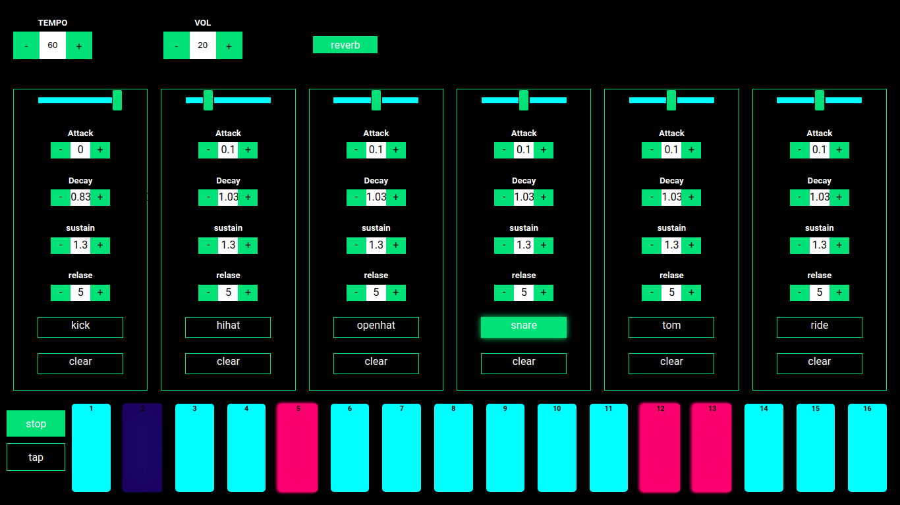

# Drum Machine

A drum machine made using React and Web audio api.

try it [here](https://sttronn.github.io/Drums-2.0/) 

## Run Locally

`https://github.com/StTronn/Drums-2.0.git`

`npm install`

`npm run build`

`npm start`

## Audio Graph
The buffer source is created for each sound played. This buffer is passed through the envelope and a gain node the values of both the envelope and gain node are handled by the instrument component. Since the envelope requires `context.currrentTime` the envelope is managed simultaneously with the play function As handling it at instrument level would require passing additional props down. The endpoint of each instrument is connected to a master volume and a a reverb node which can be turned on or off.   

## Thanks
Boris smus [book](https://smus.com/webaudio-book/) 

nick thompson for reverb [code](https://github.com/web-audio-components/simple-reverb)

[Cris Wilson](https://github.com/cwilso)

daniel shiffman adsr Envelope [video]('https://www.youtube.com/watch?v=wUSva_BnedA&list=PLRqwX-V7Uu6aFcVjlDAkkGIixw70s7jpW&index=8&t=497s')
